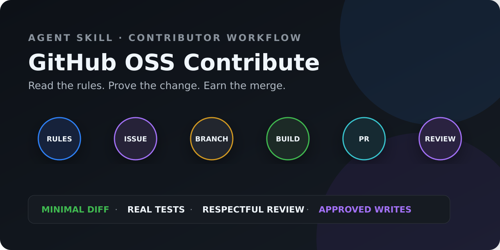

<div align="center">

# 🤝 GitHub OSS Contribute / 开源贡献导航

**Full-journey guidance from picking an Issue to getting your PR merged: read the repo's rules first, build the smallest change, earn trust with real verification and sustained responsibility.**

**English · [简体中文](./README.md)**

[](https://github.com/hyt315/github-oss-contribute/actions/workflows/validate.yml)
[](https://github.com/hyt315/github-oss-contribute/releases/latest)
[](https://github.com/hyt315/github-oss-contribute/releases)
[](CONTRIBUTORS.md)
[](LICENSE)
[](https://github.com/hyt315/github-oss-contribute/stargazers)

</div>



---

## 📖 What is this?

A high-quality open-source contribution is not "let AI edit it and file the PR". **GitHub OSS Contribute** is an AI Agent Skill that moves the contributor's judgment *before* coding: does the project accept this kind of change, is the Issue already claimed, what local rules exist, how to verify, how maintainers prefer to communicate — and it draws a clear permission boundary before **every external action**. Six stages end to end: reconnaissance → issue selection → preparation → development → submission → tracking (CI diagnosis, review handling, waiting strategy, until merge).

### ✨ Core Features

| Stage | What the Skill does | Quality gate |
| --- | --- | --- |
| Reconnaissance | Reads README, CONTRIBUTING, AGENTS, **Rulesets**, CI, templates, DCO/CLA and AI policy | Never invents rules that don't exist |
| Issue selection | Assesses scope, reproducibility, activity, claim status and maintainer intent | Discuss big changes first; never grab claimed Issues |
| Local development | Branch naming, minimal diff, test & commit plan, **signing and AI disclosure** | No unrelated files, no fabricated test results |
| PR submission | Clear title, problem/solution/verification/risk description | Creating PRs, commenting and pushing require user authorization |
| CI & Review | Reads failure logs, locates root causes, handles feedback item by item (incl. **Bot Reviewers**) | No spamming, no nagging, no hiding AI usage |
| After merge | Branch cleanup, retrospective, finding the next contribution | One merge is not a maintainer mandate |

---

## 📚 Examples: three reproducible end-to-end cases

1. [First contribution: reconnaissance before picking an Issue](examples/README.md#示例一第一次贡献)
2. [CI failure: from logs to the minimal fix](examples/README.md#示例二ci-失败诊断)
3. [Review feedback: update the code and show evidence](examples/README.md#示例三处理-review-反馈)

---

## 🚀 Quick Start

> ✨ **One-liner install into your AI agent**: paste this to your AI assistant and it will install itself:
>
> ```text
> Please install the github-oss-contribute Skill: clone https://github.com/hyt315/github-oss-contribute into your skills directory (Claude Code: ~/.claude/skills/github-oss-contribute/; Codex: ~/.agents/skills/github-oss-contribute/; Cursor: ~/.cursor/skills/github-oss-contribute/), and verify that SKILL.md, references/, and scripts/ are all present. Whenever I want to "find an open-source issue to contribute / file a PR / handle a CI failure or review feedback", guide me through the six-stage workflow in SKILL.md.
> ```

| Platform | User-level install |
| --- | --- |
| **Claude Code** | `git clone https://github.com/hyt315/github-oss-contribute.git ~/.claude/skills/github-oss-contribute` |
| **Codex / ChatGPT** | `git clone https://github.com/hyt315/github-oss-contribute.git ~/.agents/skills/github-oss-contribute` |
| **Cursor** | `git clone https://github.com/hyt315/github-oss-contribute.git ~/.cursor/skills/github-oss-contribute` |

> Project-level installs use `.claude/skills/`, `.agents/skills/` or `.cursor/skills/` in the project root. Restart your agent if a fresh install isn't discovered.

---

## 💬 When to trigger

Say any of these to your AI agent:

- "I want to contribute to an open-source project" / "find me a good first issue"
- "Help me file a PR" / "what should a first-time contributor watch out for?"
- "My PR's CI is red" / "my PR got rejected" / "how do I reply to review comments?"

## ⚙️ Prerequisites

- **Git** installed (verify repo-level user.name / user.email before committing)
- Reconnaissance of public repos needs **no authentication at all**; write capability (official connector, `gh`, MCP OAuth, fine-grained PAT, or manual web) is only checked before Fork / comment / push / PR creation — in that priority order
- Never paste tokens into chat; when auth is unavailable, read-only reconnaissance and local work continue — only the blocked external writes pause

## 📦 Deliverables

```text
📋 Reconnaissance report — contribution rules / activity rating / AI Policy / DCO-CLA / watch-outs
🎯 Issue shortlist       — scored candidates + claim status + a draft "I'd like to work on this" comment
🛠️ Dev & commit plan     — branch naming / minimal diff / commit conventions / signing & disclosure
📤 High-quality PR       — title / description / test evidence / AI disclosure (per repo template)
🩺 CI & Review           — failure root-cause / item-by-item feedback / waiting strategy / Merge Queue notes
```

---

## 📥 Download / Install

```bash
# HTTPS
git clone https://github.com/hyt315/github-oss-contribute.git

# SSH
git clone git@github.com:hyt315/github-oss-contribute.git

# GitHub CLI
gh repo clone hyt315/github-oss-contribute

# ZIP
# https://github.com/hyt315/github-oss-contribute/archive/refs/heads/main.zip

# Single file (SKILL.md only)
curl -O https://raw.githubusercontent.com/hyt315/github-oss-contribute/main/SKILL.md
```

---

## 📁 File Structure

```
github-oss-contribute/
├── SKILL.md                        # entry point (six-stage workflow)
├── references/
│   ├── ai-slop-guide.md            # anti-AI-slop deep guide
│   ├── commit-conventions.md       # commit conventions / DCO / signing
│   ├── communication-etiquette.md  # review communication templates
│   ├── first-timer-tips.md         # first-timer tips & platforms
│   ├── git-errors.md               # Git error quick reference
│   ├── mcp-tools.md                # GitHub capability mapping & fallbacks
│   └── security-guide.md           # security practice & leak response
├── scripts/
│   ├── validate-skill.mjs          # structure validation (CI)
│   └── selftest.py                 # regression (good fixture green + negatives caught)
├── examples/README.md              # three end-to-end examples
├── agents/openai.yaml
├── LICENSE / CHANGELOG.md
├── README.md  /  README.en.md     # bilingual docs (this file is English)
└── .github/                        # Issue/PR templates + CI(validate)
```

---

## ▶️ Quick Usage

Each stage stands alone — you may be stuck on just one:

1. **Reconnaissance**: give `owner/repo`, get a recon report (rules / activity / Rulesets / AI Policy)
2. **Issue selection**: search & score candidates, get a shortlist and a communication draft
3. **Preparation**: Fork → Clone → upstream → feature branch → local environment
4. **Development**: quality checklist → security practice → commit conventions → sync with upstream
5. **Submission**: push (with force-with-lease boundaries) → create PR → verify file list
6. **Tracking**: CI diagnosis (incl. Merge Queue) → review handling (incl. Bot Reviewers) → waiting strategy → post-merge cleanup

---

## 🤝 Contributing / Feedback

- Report bugs / suggestions: use the repo's Issue templates
- Contribute: see [CONTRIBUTING.md](CONTRIBUTING.md); run `python scripts/selftest.py` and `node scripts/validate-skill.mjs` before any PR
- Security: see [SECURITY.md](SECURITY.md) (private vulnerability reporting, not public issues)

---

## 📜 License

[MIT](LICENSE) © 2026 hyt315

> 🌏 **中文版: [README.md](./README.md)**